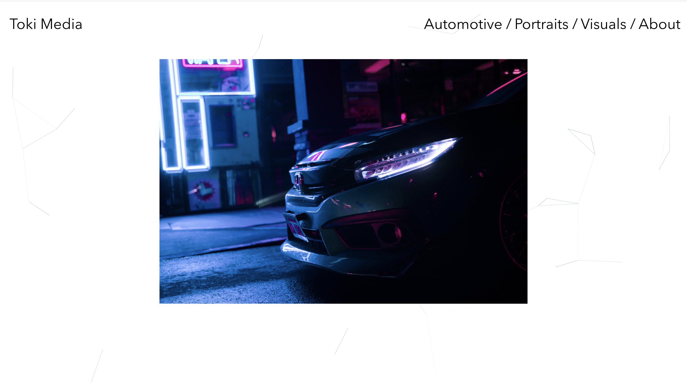

# Photography Portfolio

You can view this project at https://tnguyenswe.github.io/Photography-Portfolio/

This photography portfolio is a SPA (Single page application) built with React, Javascript, CSS, and HTML.

To build the SPA opposed to a multiple page application, I used React Router DOM for custom routing between each link.

I also used the Particles.js NPM package for the background effect as well as React Alice Carousels NPM package for the infinity image gallery.

The NPM packages can be found here:

https://www.npmjs.com/package/react-particles-js
https://www.npmjs.com/package/react-alice-carousel

This was built for the purpose of learning front end web development as well as showcasing my photography skills.

All photos are owned and taken by me.

Here is a view of the home page

